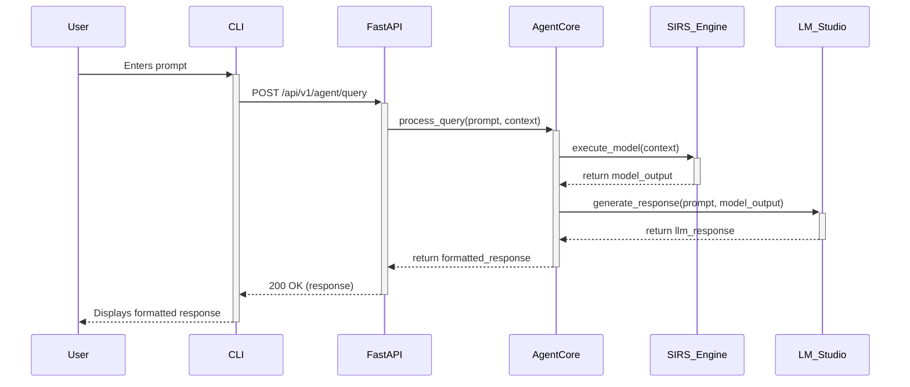

# SIRS-based LLM Agent

This project implements a sophisticated agent that combines a Large Language Model (LLM) with a probabilistic reasoning engine based on the SIRS (Symbolic, Interpretable, and Robust Systems) language. The agent uses the SIRS engine for robust, probabilistic inference and the LLM for natural language understanding and generation.

The system is exposed via a FastAPI service and can be interacted with through a command-line interface (CLI).

## Architecture

The agent is composed of four main components:

1.  **FastAPI Service (`api/`)**: Exposes a RESTful API for interacting with the agent.
2.  **Agent Core Logic (`agent_core/`)**: Orchestrates the main perception-inference-decision-action loop.
3.  **SIRS Engine Integration (`sirs_integration/`)**: A Python wrapper to communicate with the compiled Zig-based SIRS engine.
4.  **User CLI (`cli/`)**: An interactive command-line interface for sending prompts to the agent.



## Setup and Installation

### Prerequisites

- Python 3.10+
- A compiled SIRS engine executable (e.g., built from the Zig project).
- An accessible LM Studio instance (or a compatible OpenAI-like API).

### Installation Steps

1.  **Clone the repository:**
    ```bash
    git clone <repository_url>
    cd <repository_directory>
    ```

2.  **Create and activate a virtual environment:**
    ```bash
    python3 -m venv LLM-Agent/.venv
    source LLM-Agent/.venv/bin/activate
    ```

3.  **Install Python dependencies:**
    Install the required dependencies from the `requirements.txt` file:
    ```bash
    pip install -r LLM-Agent/requirements.txt
    ```

4.  **Configure your environment:**
    Copy the example environment file and customize it for your setup.
    ```bash
    cp LLM-Agent/.env.example LLM-Agent/.env
    ```
    Make sure to edit `LLM-Agent/.env` and set the correct paths and endpoints, especially `SIRS_EXECUTABLE_PATH` and `LM_STUDIO_MODEL`.

## Configuration

Configuration is managed via a `.env` file in the `LLM-Agent` directory.

1.  **Create the `.env` file:**
    Copy the example file to create your own local configuration:
    ```bash
    cp .env.example .env
    ```

2.  **Edit the `.env` file:**
    Update the variables in the `.env` file to match your local setup.

### Configuration Variables

-   `AGENT_API_URL`: The URL for the agent's FastAPI service (used by the CLI).
    -   Default: `http://127.0.0.1:8000/api/v1/agent`
-   `LM_STUDIO_ENDPOINT`: The endpoint for the LLM's chat completions API (e.g., LM Studio, OpenAI).
    -   Default: `http://localhost:1234/v1/chat/completions`
-   `LM_STUDIO_MODEL`: The model identifier to be used for the LLM API call. This is passed directly to the LLM service.
    -   Example for LM Studio: `"gemma-2b-it-q8_0.gguf"`
    -   Default: `local-model`
-   `SIRS_EXECUTABLE_PATH`: The path to the SIRS engine executable.
    -   Default: `./sirs_engine`

## Usage

### 1. Run the FastAPI Service

Navigate to the project root and run the following command:

```bash
uvicorn LLM-Agent.src.api.main:app --reload
```

The API will be available at `http://127.0.0.1:8000`.

### 2. Use the CLI

In a separate terminal (with the virtual environment activated), you can interact with the agent.

**Check the agent's status:**

```bash
python -m LLM-Agent.src.cli.cli status
```

**Start an interactive chat session:**

```bash
python -m LLM-Agent.src.cli.cli chat
```

You can then type your prompts and press Enter. Type `quit` or `exit` to end the session.

### 3. API Endpoints

You can also interact with the API directly using tools like `curl` or Postman.

-   **GET /api/v1/agent/status**: Get the agent's status.
-   **POST /api/v1/agent/query**: Send a query to the agent.
    -   **Body:**
        ```json
        {
          "session_id": "my-api-session-001",
          "prompt": "What is the capital of France?",
          "context": "User is asking a general knowledge question."
        }
        ```