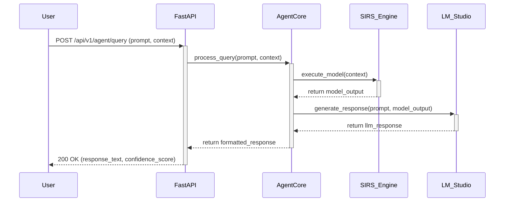

# Integration Specification

This document defines the interfaces between the Agent Core, SIRS Engine, FastAPI Service, and LM Studio.

## 1. API Contracts

This section details the API contracts for the services involved.

### 1.1. FastAPI Service Endpoints

- **/api/v1/agent/query**
  - **Method:** POST
  - **Description:** Submits a query to the LLM agent.
  - **Request Body:**
    ```json
    {
      "session_id": "string",
      "prompt": "string",
      "context": "string"
    }
    ```
  - **Response Body:**
    ```json
    {
      "session_id": "string",
      "response_text": "string",
      "confidence_score": "float"
    }
    ```

- **/api/v1/agent/status**
  - **Method:** GET
  - **Description:** Retrieves the status of the agent.
  - **Response Body:**
    ```json
    {
      "status": "string"
    }
    ```

## 2. Zig-Python Communication Protocol

Communication between the Zig-based SIRS engine and the Python services will be handled via standard input/output (stdin/stdout) using a simple JSON-RPC-like protocol.

- **Python to Zig:** Python sends a JSON object to the Zig process's stdin.
- **Zig to Python:** The Zig process writes a JSON response to its stdout.

This approach avoids network overhead and simplifies the interaction to a direct function call paradigm.

## 3. Data Flow Diagrams



## 4. Error Handling Protocols

The following table defines the standard error codes and messages passed between components. The error payload structure is defined in `data-schema-definition.md`.

| Error Code | Component | Message | Description |
|---|---|---|---|
| 1001 | FastAPI | Invalid Request Body | The request payload is malformed or missing required fields. |
| 1002 | FastAPI | Authentication Error | The API key or session is invalid. |
| 2001 | AgentCore | SIRS Engine Failed | The SIRS engine process failed to execute or returned an error. |
| 2002 | AgentCore | LM Studio Unreachable | The connection to the LM Studio API failed. |
| 2003 | AgentCore | LM Studio Error | The LM Studio API returned an error response. |
| 3001 | SIRS_Engine | Model Execution Error | An error occurred during the execution of the probabilistic model. |
| 3002 | SIRS_Engine | Invalid Input Schema | The input data does not match the required SIRS model schema. |