# SIRS Model Documentation

This document explains the design and inference logic of the SIRS probabilistic models used in the LLM Agent.

## 1. Node Definitions

This section defines the different types of nodes used in the SIRS models.

- **Observed Nodes:** Represent the data that is directly observed from the environment or user input.
- **Latent Nodes:** Represent the hidden variables or states that are inferred from the observed data.
- **Parameter Nodes:** Represent the parameters of the probabilistic models that are learned from the data.

## 2. Factor Relationships

This section describes the relationships between the nodes in the models, as defined by the factors.

The SIRS model uses a factor graph to represent the probabilistic relationships between its nodes. A factor graph is a bipartite graph consisting of variable nodes (representing Observed, Latent, and Parameter Nodes) and factor nodes (representing the functions that define the relationships between these variables).

### Factor Graph Structure:
*   **Variable Nodes:** These correspond directly to the Observed, Latent, and Parameter Nodes defined in Section 1.
*   **Factor Nodes:** These represent the conditional probability distributions or deterministic functions that link variable nodes. Each factor node connects to the variable nodes that are arguments to its function.

### Connections and Functions:
Factors define how information flows and how probabilities are computed within the model. For example:
*   A factor might connect an **Observed Node** to a **Latent Node**, representing the likelihood of observing certain data given an underlying hidden state.
*   Another factor could link a **Latent Node** to a **Parameter Node**, indicating how the latent variable's distribution is parameterized.
*   Factors can also represent deterministic relationships, such as transformations or aggregations.

### Mathematical Representation:
Each factor `f_i(X_j, ..., X_k)` represents a function that takes a subset of the model's variables as input and contributes to the overall joint probability distribution of the model. The joint probability distribution of all variables `X` in the SIRS model can be expressed as a product of these factors:

`P(X) = (1/Z) * product(f_i(connected_variables_to_f_i))`

Where `Z` is a normalization constant.

### Example Factor Graph (Mermaid Diagram):

```mermaid
graph TD
    subgraph SIRS Model Factor Graph
        Observed1[Observed Node 1] --> F1(Factor 1)
        Latent1[Latent Node 1] --> F1
        Parameter1[Parameter Node 1] --> F1

        Latent1 --> F2(Factor 2)
        Observed2[Observed Node 2] --> F2

        F1 --> Latent2[Latent Node 2]
        F2 --> Latent2

        style Observed1 fill:#692669,stroke:#333,stroke-width:2px,font-fill:#000000
        style Observed2 fill:#692669,stroke:#333,stroke-width:2px,font-fill:#000000
        style Latent1 fill:#323268,stroke:#333,stroke-width:2px,font-fill:#000000
        style Latent2 fill:#323268,stroke:#333,stroke-width:2px,font-fill:#000000
        style Parameter1 fill:#3a3a67,stroke:#333,stroke-width:2px,font-fill:#000000
        style F1 fill:#4e4e5f,stroke:#333,stroke-width:2px,font-fill:#000000
        style F2 fill:#4e4e5f,stroke:#333,stroke-width:2px,font-fill:#000000
    end
```

This diagram illustrates a simplified factor graph where `Observed1`, `Latent1`, and `Parameter1` are related by `Factor 1`, and `Latent1` and `Observed2` are related by `Factor 2`. Both `Factor 1` and `Factor 2` influence `Latent2`.

## 3. Inference Algorithm Parameters

This section specifies the parameters used for the inference algorithms (e.g., MCMC).

- **Number of Chains:** 4
- **Number of Samples:** 1000
- **Warm-up Period:** 500 samples
- **Algorithm:** No-U-Turn Sampler (NUTS)

## 4. Model Versioning Strategy

This section outlines the strategy for versioning the SIRS models.

- Models are versioned using semantic versioning (e.g., `v1.2.3`).
- Each model version is associated with a specific Git commit hash.
- A model registry will be used to store and manage different versions of the models.